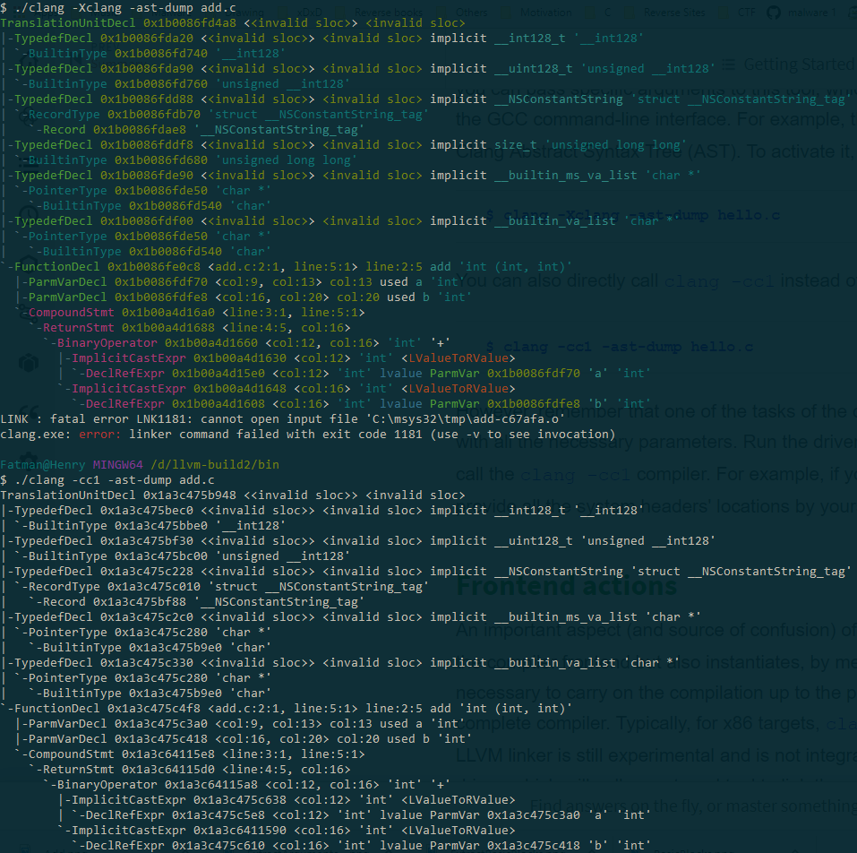
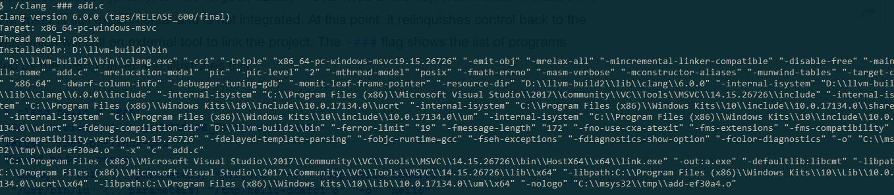

# Clang notes

Compiler driver - clang

Actual compiler - cc1

cc1 implements most of compliation up to linker. Linking is done by system linker

## Libclang

[Libclang doxygen](http://clang.llvm.org/doxygen/group__CINDEX.html)

Libclang is a stable C API to using frontend capabilities of clang.

### Libclang Libraries

| Libaries | Description
|---|---|
| libclangLex | Lexical analysis (understanding tokens) |
| libclangAST | Traverse AST representation |
| libclangParse | Lexical parsing (tokenizing) |
| libclangSema | AST analysis (Is AST okay?) |
| libclangCodeGen | IR generator |
| libclangAnalysis | Static analysis resources |
| libclangRewrite | Rewrite code |
| libclangBasic | Resources for allocating memory, get source locations and other goodies |

## Clang diagnostics

There are 5 levels of diagnostics, NOTE, WARNING, EXTENSION, EXTWARN, and ERROR to improve c/c++ errors.

Here is an image of defining the warnings.

.td files are generated into appropriate c++ language by the tablegen tool. 

As you can see above, `def` defines a record, and the naming comes after. Then, comes the `:`, followed by the class and the constructor(?)

[Link to tablegen](http://llvm.org/docs/TableGen/LangRef.html)

### Dumping diagnostics using libclang

dumps diagnostics. No modification to source

