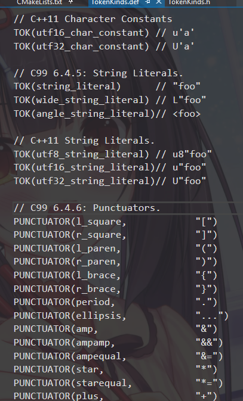
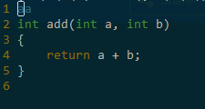
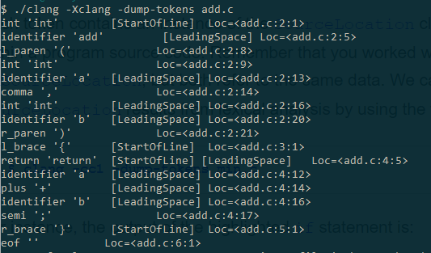
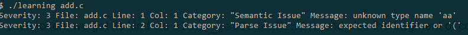
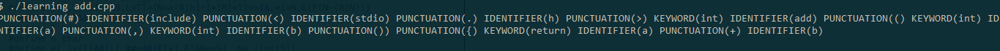
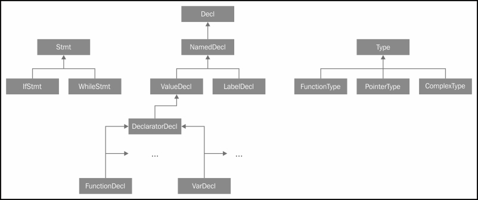
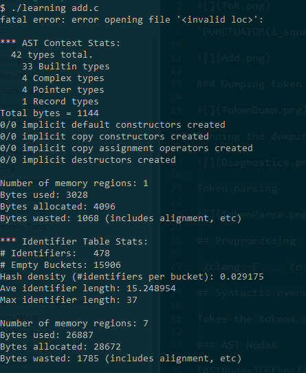
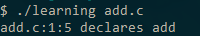

# Clang frontend overview

[Clang libclang docs](http://clang.llvm.org/doxygen/group__CINDEX__TRANSLATION__UNIT.html)

## Lexical overview

`PUNCTUATOR(l_square,            "[")` becomes `tok::l_square`

### Dumping token

Running the dumpingdiagnosics tool

Token parsing

## Preprocessing

./clang -E ... to invoke the preprocessor

## Syntactic overview

Takes the tokens and checks if the tokens form correct statements (builds AST)

### AST Nodes

[ASTNodes](http://clang.llvm.org/doxygen/classclang_1_1Stmt.html)

## Semantic Analysis

Now, check if the expressions formed from tokens do not break the language's rules.

