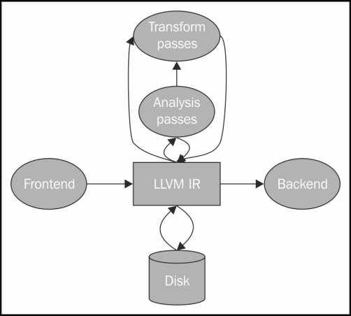

# LLVM IR overview

LLVM IR is intermediate language between high level langs and assembly.

MachineFunction and MachineInstr are target machines.

Function and Instruction are important since that are most common IR across all machines.

Target dependency is hard because C types are already target dependent (ex, x86 vs x64 int sizes are different, calling convention are different)

